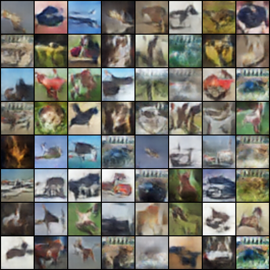

# CIFAR10 & ArtBench-10 DCGAN

This project implements a DCGANs to generate artistic images using the [ArtBench-10](https://artbench.eecs.berkeley.edu) and [CIFAR-10](https://www.cs.toronto.edu/~kriz/cifar.html) datasets. Deep Convolutional Generative Adversarial Networks (DCGANs) are a type of GAN that leverages deep convolutional neural networks for generating high-quality images. They consist of two neural networks: a generator that creates images from random noise and a discriminator that distinguishes between real and generated images. DCGANs improve training stability and image quality by using convolutional layers, batch normalization, and specific architectural choices. 

The aim of the project is to experiment with image generation, improving the ability of GANs to create convincing artistic styles. `CIFAR` fake images on the left and `ARTBENCH` fake images on right:

  
  

## Project Features

- **GAN Model Implementation**: A standard Deep Convolutional GAN (DCGAN) is implemented for generating new artwork images based on the ArtBench-10 dataset.
- **Training Process**: The training process includes detailed logging of the losses for both the generator and discriminator, along with saving generated image samples at each epoch.
- **Support for Multiple Image Datasets**: While it works primarily with ArtBench-10, the architecture can be adapted for other datasets like CIFAR-10 with minimal changes.
- **Image Transformations**: Includes options for preprocessing and normalizing images to ensure the GAN receives standardized input.
- **Save and Load Functionality**: Checkpoints of the model are saved during training for later reuse or fine-tuning.

## Dataset

The [ArtBench-10](https://artbench.eecs.berkeley.edu) dataset contains artwork images across 10 categories:
- **Categories**: Baroque, Impressionism, Renaissance, Cubism, Surrealism, etc.
- The dataset consists of low-resolution 32x32 images, similar in structure to CIFAR-10, making it compatible with existing deep learning pipelines.

The [CIFAR-10](https://www.cs.toronto.edu/~kriz/cifar.html) dataset is a well-known benchmark in the field of machine learning and computer vision:
- **Categories**: The CIFAR-10 dataset comprises 10 classes, including Airplane, Automobile, Bird, Cat, Deer, Dog, Frog, Horse, Ship, and Truck.
- The dataset consists of 60,000 color images, each with a resolution of 32x32 pixels, split into 50,000 training images and 10,000 test images.
- CIFAR-10 is widely used for training and evaluating machine learning models, particularly convolutional neural networks (CNNs), due to its manageable size and well-defined categories.

## Usage

1. Clone the repository
2. `pip install -r requirements.txt`
3. `python scripts/train_gan.py
4. Check results folder for generated images
5. check home directory for saved/trained generator and discriminator   
